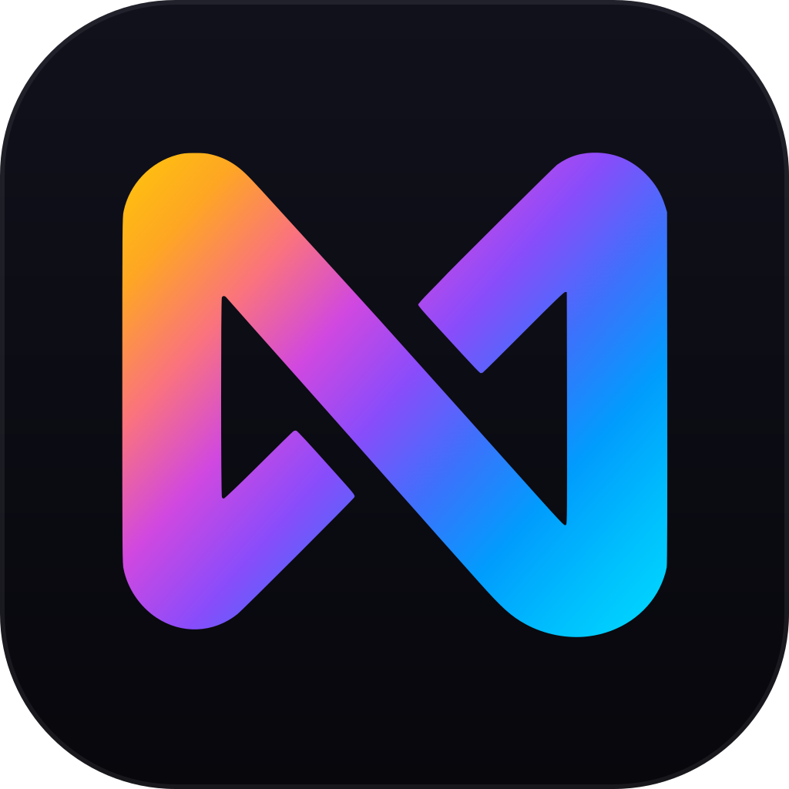
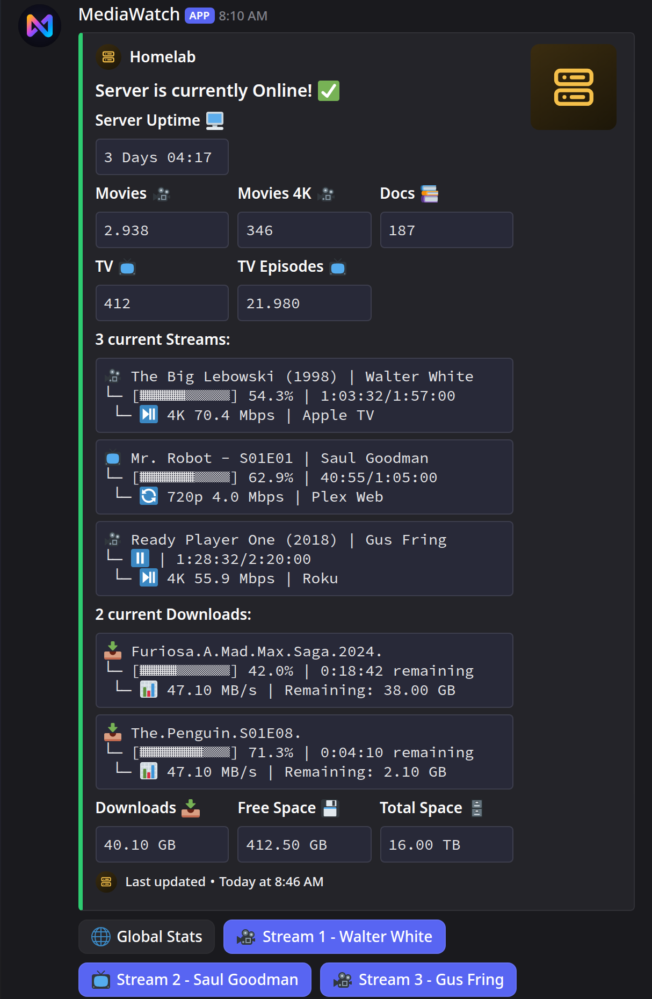
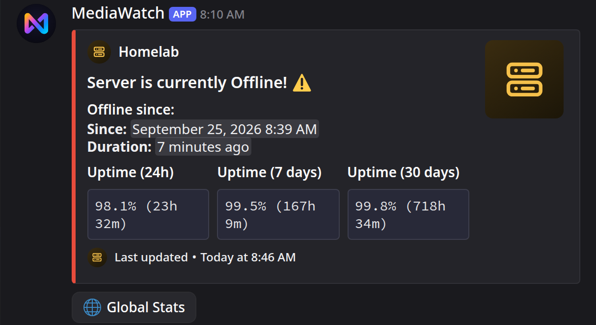
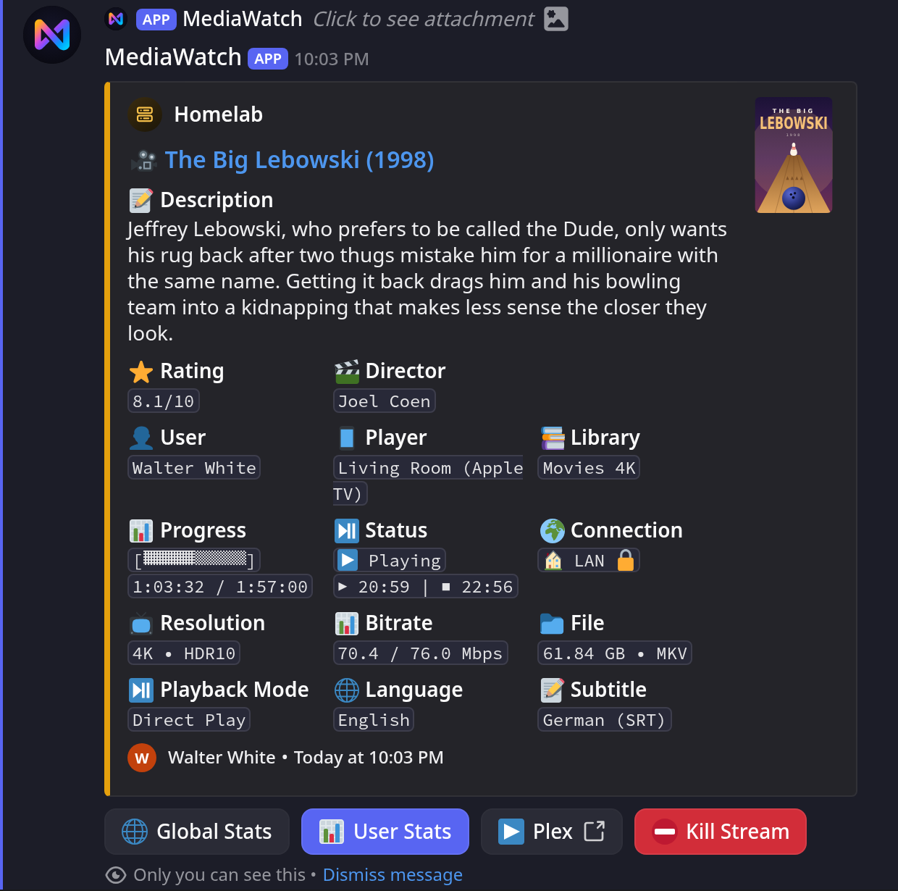
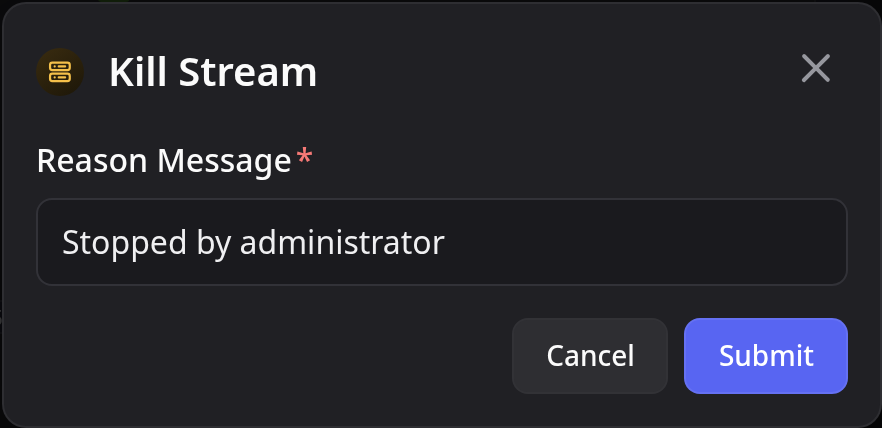
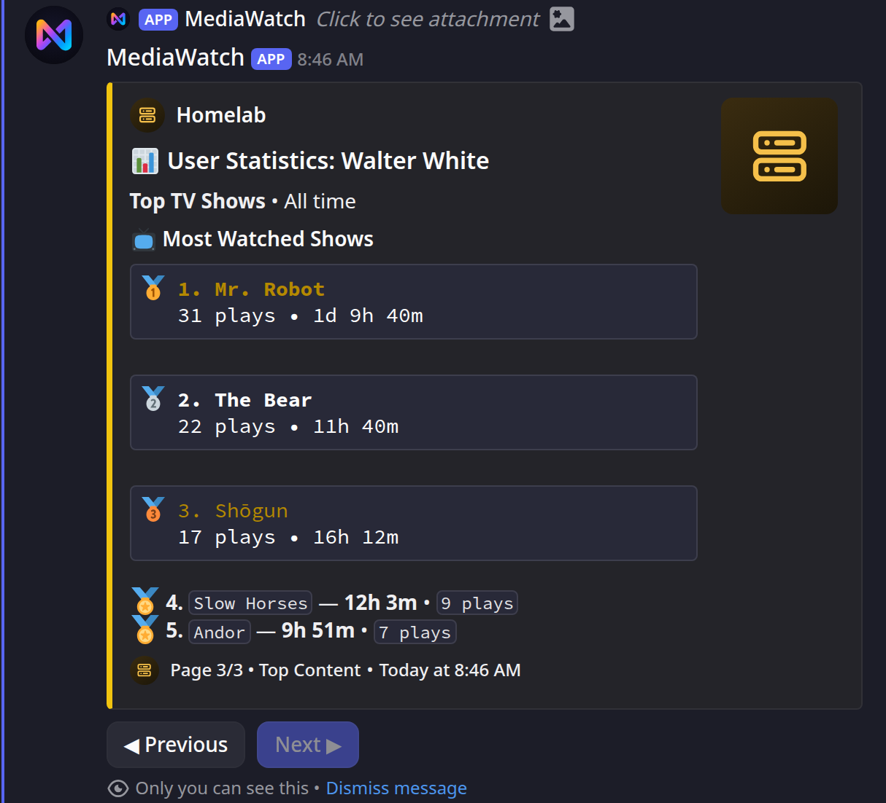
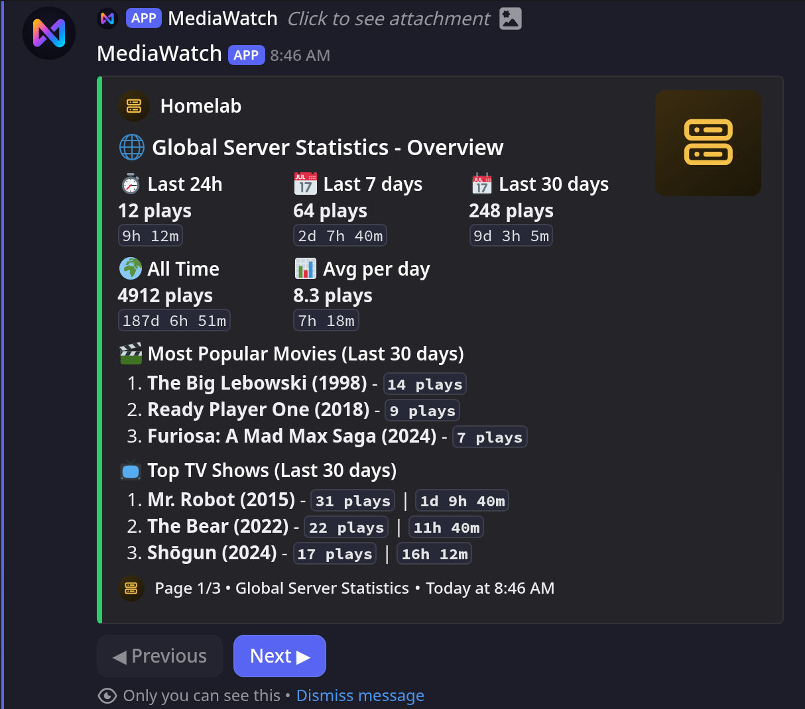
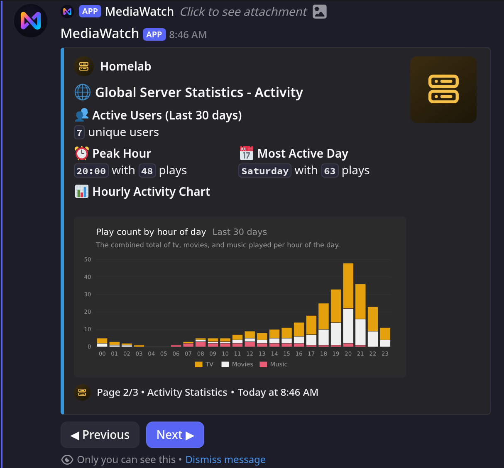
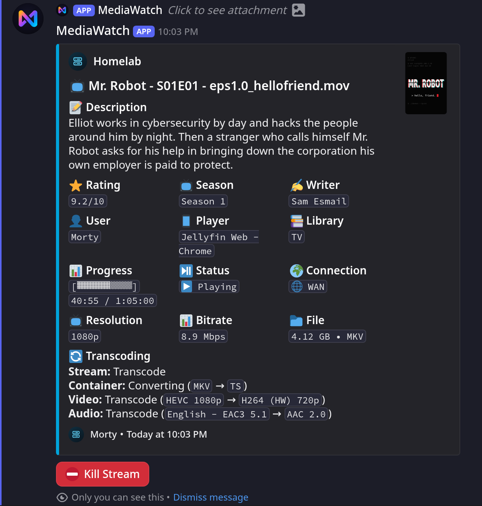

<div align="center">



# MediaWatch

**A Discord-first monitoring bot for self-hosted media servers.**

One live dashboard inside Discord for Plex or Jellyfin: active streams, library totals,
server state, with optional SABnzbd and Uptime Kuma data.

<a href="https://github.com/nichtlegacy/MediaWatch/releases/latest"></a>
<a href="https://github.com/nichtlegacy/MediaWatch/actions/workflows/ci.yml"></a>


[Website](https://mediawatch.nichtlegacy.com/) • [Documentation](https://mediawatch.nichtlegacy.com/docs/) • [Quick Start](#quick-start) • [Platform Scope](#platform-scope) • [Roadmap](#roadmap)


</div>

## What It Does

- Publishes a persistent Discord dashboard and updates it in place
- Tracks active Plex or Jellyfin sessions in near real time
- Shows library totals and server state in the same embed
- Adds optional download and uptime sections via SABnzbd and Uptime Kuma
- Offers interactive stream details and stream termination
- Keeps runtime state in local files instead of Postgres or Redis

This is not a web app and not a multi-user control panel. It is an operational bot for
people who already live in Discord and want their media server status there.

## Platform Scope

MediaWatch loads exactly **one** platform at runtime, selected by `media_server.type`.

| Capability | Plex | Jellyfin |
| --- | :---: | :---: |
| Live dashboard and library totals | ✅ | ✅ |
| Stream details | With Tautulli | ✅ |
| Kill Stream | ✅ | ✅ |
| SABnzbd and Uptime Kuma | ✅ | ✅ |
| User and global statistics | With Tautulli | ❌ |
| Open in the media server | With Tautulli | ❌ |

Plex has the richer surface because MediaWatch can layer Tautulli on top. Jellyfin support
is intentionally narrower but uses the same dashboard model and runtime architecture.

## Screenshots

<table>
  <tr>
    <td width="50%">
      <strong>Dashboard</strong><br>
      
    </td>
    <td width="50%">
      <strong>Offline State</strong><br>
      
    </td>
  </tr>
</table>

<table>
  <tr>
    <td width="50%">
      <strong>Stream Details</strong><br>
      
    </td>
    <td width="50%">
      <strong>Kill Stream Modal</strong><br>
      
    </td>
  </tr>
</table>

<details>
  <summary><strong>Tautulli User Stats</strong></summary>
  <br>
  <table>
    <tr>
      <td width="33%">
        <strong>Page 1</strong><br>
        
      </td>
      <td width="33%">
        <strong>Page 2</strong><br>
        
      </td>
      <td width="33%">
        <strong>Page 3</strong><br>
        
      </td>
    </tr>
  </table>
</details>

<details>
  <summary><strong>Tautulli Global Stats</strong></summary>
  <br>
  <table>
    <tr>
      <td width="33%">
        <strong>Page 1</strong><br>
        
      </td>
      <td width="33%">
        <strong>Page 2</strong><br>
        
      </td>
      <td width="33%">
        <strong>Page 3</strong><br>
        
      </td>
    </tr>
  </table>
</details>

<details>
  <summary><strong>Jellyfin</strong></summary>
  <br>
  <table>
    <tr>
      <td width="50%">
        <strong>Dashboard</strong><br>
        
      </td>
      <td width="50%">
        <strong>Stream Details</strong><br>
        
      </td>
    </tr>
  </table>
</details>

## Quick Start

Docker is the recommended way to run MediaWatch.

```yaml
services:
  mediawatch:
    image: ghcr.io/nichtlegacy/mediawatch:latest
    container_name: mediawatch
    restart: unless-stopped
    env_file:
      - .env
    environment:
      RUNNING_IN_DOCKER: "true"
    volumes:
      - ./data:/app/data
```

```bash
curl -fsSL -o .env https://raw.githubusercontent.com/nichtlegacy/MediaWatch/main/.env.example
mkdir -p data
curl -fsSL -o data/config.yaml https://raw.githubusercontent.com/nichtlegacy/MediaWatch/main/data/config.yaml.example
# fill in .env, then set media_server.type and your libraries in data/config.yaml
docker compose up -d
docker compose logs -f
```

Keeping secrets in `.env` leaves `docker-compose.yml` safe to share. Setting them under
`environment:` or in an Unraid template works just as well. See
**[Docker Deployment](https://mediawatch.nichtlegacy.com/docs/deployment/docker/)**.

You need a Discord bot token, a channel ID, your guild ID, at least one authorized user
ID, and credentials for either Plex or Jellyfin. The
**[Setup Guide](https://mediawatch.nichtlegacy.com/docs/getting-started/)** walks through obtaining each one.

## Documentation

The full documentation lives at **[mediawatch.nichtlegacy.com/docs](https://mediawatch.nichtlegacy.com/docs/)**.

| Page | What it covers |
| --- | --- |
| **[Setup Guide](https://mediawatch.nichtlegacy.com/docs/getting-started/)** | From a fresh Discord application to a running dashboard |
| **[Docker Deployment](https://mediawatch.nichtlegacy.com/docs/deployment/docker/)** | Compose, volumes, `PUID`/`PGID`, logs, updates |
| **[Configuration](https://mediawatch.nichtlegacy.com/docs/configuration/)** | Every option in `config.yaml` with its default |
| **[Privacy and Visibility](https://mediawatch.nichtlegacy.com/docs/usage/privacy/)** | Who in the channel can see what, and how to restrict it |
| **[Troubleshooting](https://mediawatch.nichtlegacy.com/docs/operations/troubleshooting/)** | The common failure modes and their exact messages |
| **[Migration from 1.x](https://mediawatch.nichtlegacy.com/docs/operations/upgrading-from-1x/)** | Upgrading a PlexWatch install |

## Running Locally

```bash
git clone https://github.com/nichtlegacy/MediaWatch.git
cd MediaWatch
python -m venv .venv && source .venv/bin/activate
pip install -r requirements.txt
cp .env.example .env
cp data/config.yaml.example data/config.yaml
python main.py
```

A local run reads `.env` through `python-dotenv` and writes rotating logs to
`logs/mediawatch_debug.log`. Apart from a startup failure (missing credentials or an
unreadable `config.yaml`), nothing is printed to the console, so check the log file.

## Slash Commands

All commands are restricted to the IDs in `DISCORD_AUTHORIZED_USERS` and published into
`DISCORD_GUILD_ID` on every start.

| Command | Purpose |
| --- | --- |
| `/cogs` | List all cogs and their load state |
| `/load`, `/unload`, `/reload` | Manage a single cog |
| `/reload_config` | Re-read `config.yaml` without restarting |
| `/mapping add·edit·remove·list` | Map media server usernames to display names |
| `!sync [guild\|global\|copy\|clear\|clearglobal]` | Publish the command tree after local changes |

`!sync` is the only reason the bot requests the Message Content intent.

## Privacy

By default **everyone who can read the dashboard channel** can open stream details, and on
Plex with Tautulli also the per-user statistics behind them and the global statistics,
including a server-wide top-users leaderboard. Three options close that down:

```yaml
stream_details:
  restrict_to_authorized: true
user_stats:
  restrict_to_authorized: true
global_stats:
  restrict_to_authorized: true
```

Client IP addresses are stricter still: they need a config flag **and** membership in
`DISCORD_AUTHORIZED_USERS`. Details in **[Privacy and Visibility](https://mediawatch.nichtlegacy.com/docs/usage/privacy/)**.

## Architecture

```text
main.py                     boots the bot, syncs commands, loads cogs
cogs/media_core/
  shared/                   models, config, formatters, dashboard embed
  plex/                     Plex runtime, services, views, Tautulli
  jellyfin/                 Jellyfin runtime, client, views, embeds
cogs/sabnzbd.py             optional modules outside the platform core
cogs/uptime.py
cogs/user_mapping.py
data/                       config and bot-managed state
```

Exactly one of `plex` or `jellyfin` is loaded at runtime. Both go through the same
`MediaService` protocol and the same dashboard embed, so the Discord-facing behaviour is
identical where the platforms allow it. Runtime state is file-backed.

## Roadmap

Planned, not promised. This is a spare-time project and the order can change. Nothing
here is required for what 2.0 already does.

<details>
  <summary><strong>What is planned</strong></summary>
<br>

**Self-hosted uptime tracking**

The bot already polls the media server every minute and already decides online from
offline. Recording that history removes the need for Uptime Kuma, which is currently the
only way to get uptime percentages into the dashboard.

Uptime Kuma stays supported and remains the more accurate source, for one reason worth
stating plainly: it runs independently of the bot, so it also sees outages that happen
while the bot itself is down. Self-tracking cannot. The plan therefore reports those
periods as *unknown* rather than counting them as uptime. A slightly smaller number that
can be trusted beats a flattering one that cannot.

**Statistics for Jellyfin**

Jellyfin currently has no user or global statistics, because those are built on Tautulli
and Tautulli is Plex-only. Jellyfin's official Playback Reporting plugin exposes
comparable data, which would let both platforms offer the same pages.

**Notifications**

The dashboard overwrites its own state, so nothing tells you that something *happened*
while you were not looking. The bot already sees most of these every minute and simply
discards them; the rest would need new polling:

- Server went offline, and came back after how long
- Rejected credentials, disk running out of space
- Stream started, finished, or fell back to transcoding
- New media added, failed library scan (not polled yet)

Most of it would default to off. A notification you learn to ignore is worse than none.

Have a different idea, or need one of these sooner? Open an issue. Knowing that someone
actually wants a feature is what moves it up the list.

</details>

## Upgrading from PlexWatch 1.x

MediaWatch grew out of `PlexWatch`. Three things are **not** automatic: the image path
changed to `ghcr.io/nichtlegacy/mediawatch`, `DISCORD_GUILD_ID` is now required, and you
should check the result of the automatic `config.json` conversion. The full path is in the
**[migration guide](https://mediawatch.nichtlegacy.com/docs/operations/upgrading-from-1x/)**.

## Development

```bash
pip install -r requirements-dev.txt
pytest
ruff check . && ruff format --check .
```

`ruff` is the only lint and format tool; its config lives in `pyproject.toml`. See
[CONTRIBUTING.md](CONTRIBUTING.md) before opening a pull request, and
[SECURITY.md](SECURITY.md) for reporting a vulnerability.

## How this project is built

MediaWatch is written with extensive help from AI coding assistants. PlexWatch 1.x started
the same way: it worked better than I expected, but its internals were not built to last,
which is what the 2.0 rewrite addresses.

I have run MediaWatch in production on my own server since early 2026, and the features
and fixes since then come from using it every day. CI runs the full test suite on every
push and pull request.

---

<p align="center">
  <strong><a href="LICENSE">MIT License</a></strong> © 2025 <a href="https://github.com/nichtlegacy">nichtlegacy</a>
</p>
