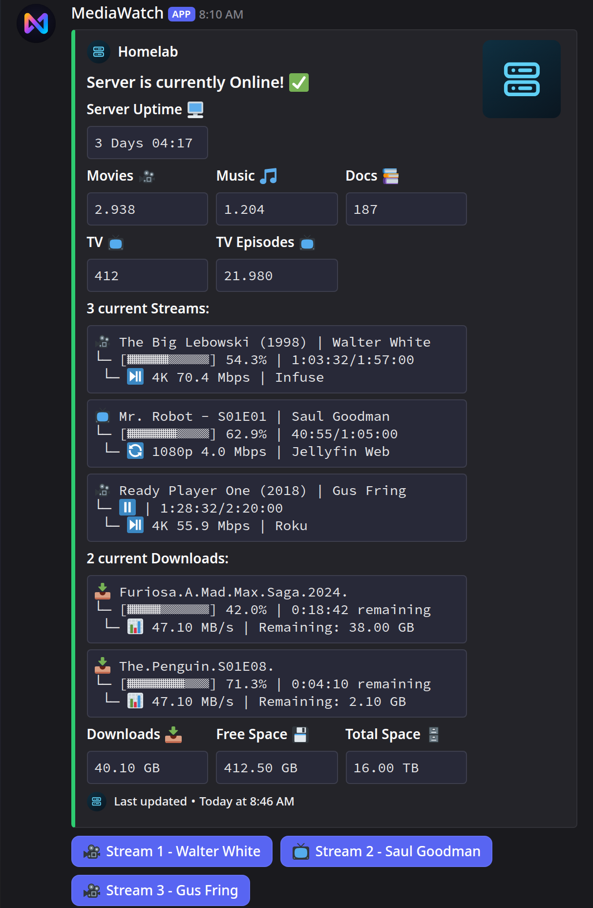
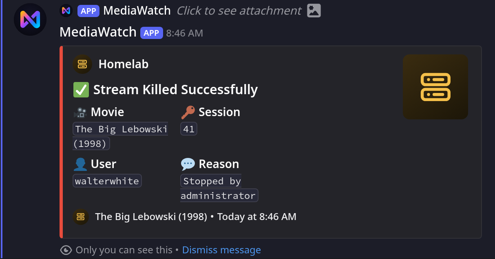
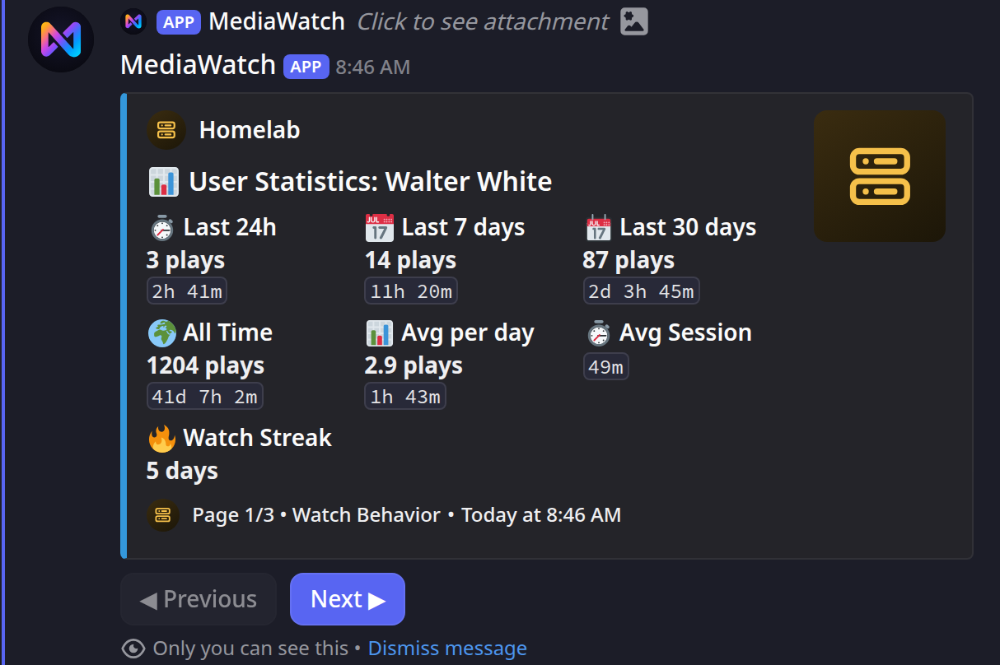
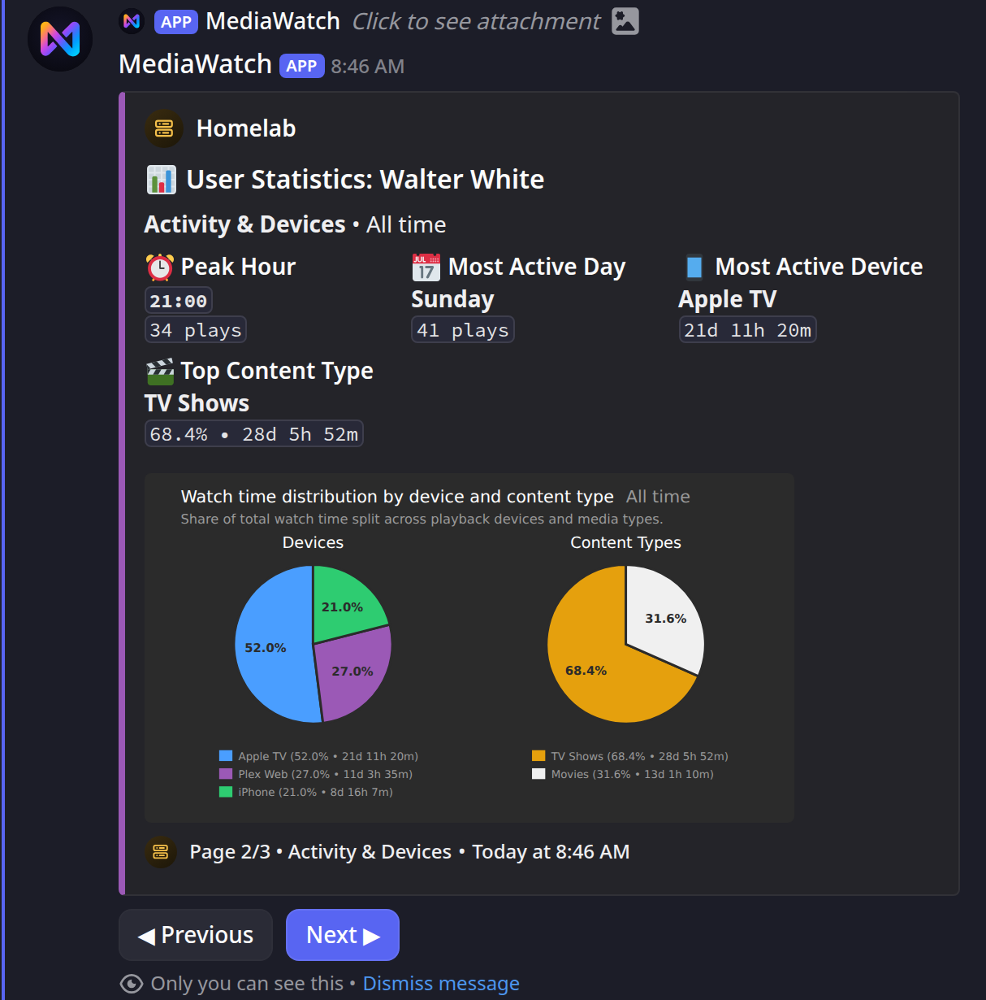
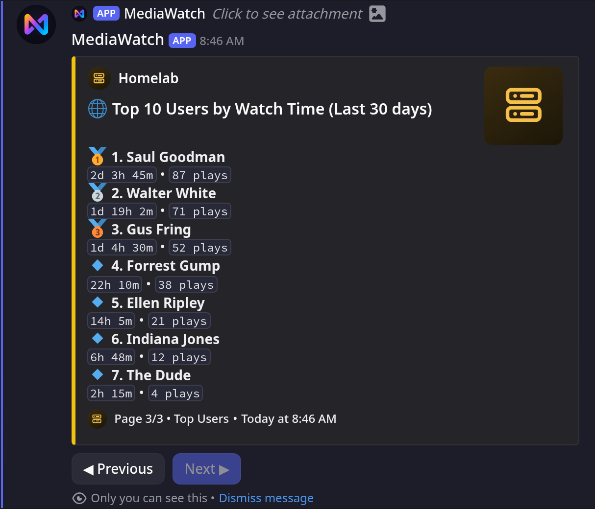

# The Dashboard

The dashboard is the product. Everything else in MediaWatch exists to keep this one
Discord message current.

## One message, updated in place

MediaWatch does not post a new message per update. It creates the dashboard once and
edits that same message from then on, so the channel stays a single message deep no
matter how long the bot runs.

The message ID is written to `data/dashboard_message_id.json`:

```json
{
  "message_id": 123456789012345678
}
```

That file is why a restart does not produce a second dashboard. What follows from it:

- The embed is rebuilt and the message edited **once per minute**.
- If the message was deleted, the bot logs `Dashboard message not found, creating new one`,
  posts a fresh one and stores the new ID.
- To move the dashboard to another channel, change `CHANNEL_ID` and restart. The stored ID
  is not found in the new channel, so the bot posts a fresh dashboard there. The old
  message stays behind in the old channel, frozen; delete it by hand.

!!! note "The bot must be able to edit its own message"

    If the bot loses permission to the channel, the update is logged as a failure and
    the old embed simply freezes. A stale "Last updated" timestamp in the footer is the
    first symptom. Once permission is back, the bot posts a new dashboard instead of
    resuming the old one; delete the frozen message by hand.

## When the server is online

=== "Plex"

    { loading=lazy }

=== "Jellyfin"

    { loading=lazy }

Title **"Server is currently Online! ✅"**, green. The author line, thumbnail and footer
icon come from the `dashboard` block in `data/config.yaml`; the footer always reads
`Last updated` followed by the timestamp of the last edit.

| Section | What it shows |
| --- | --- |
| `Server Uptime 🖥️` | How long MediaWatch has seen the server reachable without a break, not the server's own uptime. Persisted, so restarting the bot for an image update does not reset it; a longer absence drops it. See [the uptime baseline](../reference/architecture.md#shutdown-and-the-uptime-baseline). |
| One tile per library | The item count, plus a separate `… Episodes 📺` tile for sections with `show_episodes: true`. Names and emoji come from your config; unconfigured sections follow in the order the server reports them. |
| `N current Streams:` | One code block per running stream: title, progress, quality and player. Quality is the resolution, or bit depth and sample rate for music (`24bit 96kHz`). Without streams the field reads `Current Streams:` / `💤 No active streams currently`. |
| `N current Downloads:` | Only when SABnzbd is configured. Adds `Downloads 📥`, `Free Space 💾` and `Total Space 🗄️`. With no queue the block is hidden, or with `sabnzbd.show_when_empty: true` reduced to `Current Downloads:` / `💤 No active downloads currently`, without the three tiles. |

!!! note "Uptime Kuma numbers are not in the online embed"

    The `Uptime (24h)` / `(7 days)` / `(30 days)` fields are only rendered while the
    server is **offline**, because that is the moment the history is interesting. An online
    dashboard shows no Uptime Kuma data even with the integration fully configured.

## When the server is offline

{ loading=lazy }

Title **"Server is currently Offline! ⚠️"**, red. The libraries and stream list are
dropped; what remains is:

- `Offline since:` with **Since** as an absolute timestamp and **Duration** as a relative
  one. Both are Discord timestamps, so every reader sees them in their own timezone.
- `Uptime (24h)`, `Uptime (7 days)`, `Uptime (30 days)` when Uptime Kuma is configured
  and has data. Without it the three fields are omitted entirely.

!!! warning "Offline is delayed on purpose"

    `server.offline_threshold` (default `300` seconds) has to elapse before the embed
    flips. Until it does, the dashboard keeps the **online** title with the last cached
    library counts and an **empty stream list**, so a brief media server restart shows
    up as "no one is watching", not as a red dashboard.

    The delay only applies once the bot has reached the server since it started. If the
    server is already unreachable at startup, the dashboard shows offline immediately.

## When the token is rejected

Title **"Server rejected the credentials! ⛔"**, orange, with a single field:

> **Authentication failed:**
> The server is reachable, but it rejected the credentials (HTTP 401/403).
> Check **PLEX_TOKEN** in your `.env` file and restart the bot. The media server itself
> is not down.

On Jellyfin the same field names `JELLYFIN_API_KEY`.

This is a state of its own since 2.0. In 1.x a wrong token looked exactly like an outage,
which sent people debugging a media server that was running fine. It is also reported
**immediately** and does not wait out `offline_threshold`, because a rejected credential
is not a transient failure. See
[Troubleshooting](../operations/troubleshooting.md#the-dashboard-says-offline-although-the-server-is-running).

## The bot presence

The bot's status in the member list follows the same state, on its own five-minute loop:

| State | Presence text | Status |
| --- | --- | --- |
| Offline | `presence.offline_text`, default `🔴 Server Offline!` | `presence.offline_status`, default Do Not Disturb |
| Credentials rejected | `presence.auth_failed_text`, falling back to `presence.offline_text` | `presence.offline_status` |
| Online, at least one stream | `presence.stream_text`, default `{count} active Stream{s} 🟢` | Online |
| Online, no streams | The library counts listed under `presence.libraries`, joined by a vertical bar | Online |
| Online, no streams, no libraries configured | `No streams or libraries configured` | Online |

Two honest details: the presence loop runs every five minutes while the dashboard runs
every minute, so the presence can lag behind the embed by up to five minutes. And by
default a rejected token shows `offline_text` like a real outage; set
`presence.auth_failed_text` to tell the two apart in the presence as well.

## The buttons

The dashboard carries up to nine buttons, all of which answer **ephemerally**: only the
person who clicked sees the result.

| Button | Appears when | What it does |
| --- | --- | --- |
| `Stream N - User` | A stream is running (one per stream, max 8). Names longer than 15 characters are cut to 12 plus `...` | Opens the details for that stream: device, player, quality, transcode decision, tracks |
| `🌐 Global Stats` | Plex **with** Tautulli, and `global_stats.button_location` is `dashboard` or `both` | Opens the paginated server-wide statistics |

Inside the ephemeral stream details there can be up to four more:

| Button | Appears when |
| --- | --- |
| `🌐 Global Stats` | Plex with Tautulli and `button_location` is `stream_details` (the default) or `both` |
| `📊 User Stats` | Plex with Tautulli, and Tautulli knows the user behind the session. With `user_stats.enabled: false` the button still appears and answers `❌ User statistics feature is disabled.` `user_stats.restrict_to_authorized` limits it to authorized users |
| `▶️ Plex` | Plex with Tautulli, unless `stream_details.links.plex.enabled` is `false`. It rides along with the details embed, so a Tautulli outage takes it with it |
| `⛔ Kill Stream` | The clicking user is in `DISCORD_AUTHORIZED_USERS`. Opens a modal for the termination message |

`Plex` is a link button: it opens the played item in Plex Web, or in the Plex app on a
phone, and triggers nothing in the bot. The **title of the details embed** links to the
same place. Music opens the album, because Plex Web has no page for a single track. Icon,
target URL and on/off live in
[`stream_details.links.plex`](../configuration/reference.md#stream_details). Pointing
`base_url` at your own Plex Web drops the hand-off to the phone app.

On Jellyfin the stream details carry `Kill Stream` only, and not at all when the details
fail to load. Global and user statistics are Tautulli-backed and the Plex link is, too. On
Plex, `Kill Stream` stays available even when Tautulli cannot deliver the details.

On Plex the per-stream buttons need either Tautulli or at least one authorized user; with
neither, there is nothing behind them and they are not attached. Jellyfin always attaches
them. The dashboard buttons themselves never expire. The buttons inside the stream details stop
responding after five minutes, the page buttons of the user and global statistics after
three. Click the dashboard button again.

### What the buttons open

=== "Stream details"

    { loading=lazy }

=== "Jellyfin details"

    { loading=lazy }

=== "Kill Stream"

    The modal takes the message the viewer sees; it is prefilled with
    `stream_controls.kill_stream.default_reason`.

    { loading=lazy }

    { loading=lazy }

=== "User stats"

    Three pages: watch behaviour, activity and devices, top content.

    { loading=lazy }

    { loading=lazy }

    { loading=lazy }

=== "Global stats"

    Three pages: overview, hourly activity, top users.

    { loading=lazy }

    { loading=lazy }

    { loading=lazy }

!!! warning "By default everyone in the channel can press these"

    Both `Stream N` and `Global Stats` are open to every channel member unless you say
    otherwise. See [Privacy and visibility](privacy.md).

## Known limits

These are Discord's limits, not arbitrary choices: an embed accepts at most 25 fields,
1024 characters per field value and 6000 characters in total. Exceeding any of them makes
Discord reject the whole update, which would freeze the dashboard silently.

- **At most 8 streams** are listed, and at most 8 stream buttons are attached. The field
  header says so instead of hiding it: `12 current Streams: (showing 8 of 12)`.
- **At most 15 library fields.** A section with `show_episodes: true` consumes two of
  them. When sections are dropped, a line `(showing 6 of 9 libraries)` is added below the
  tiles.
- **The stream list can be cut below 8** when the blocks are long, because the field value
  budget is shared with the downloads block. The number in the header is what was actually
  rendered, not a fixed 8.
- **At most 4 downloads** are listed. Like the stream list, the header says so: a queue of
  six reads `6 current Downloads: (showing 4 of 6)`. The size, free space and total space
  tiles below always cover the whole queue.
- **Library totals are cached** for `cache.library_update_interval` seconds (default 900),
  so a newly added library can take up to 15 minutes to appear.
- **Uptime Kuma data appears only in the offline embed**, as noted above.

If you regularly exceed the 15-field cap, set `show_all: false` and list the sections you
actually want in the `plex:` / `jellyfin:` block. See the
[configuration reference](../configuration/reference.md).
